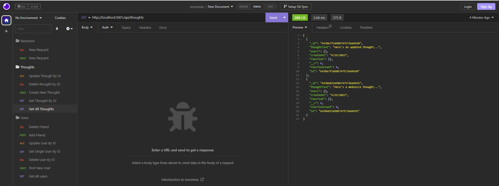

# Social NoSql APIs

Social APIs using Mongo NoSql Database

## Description

The purpose of this project was to create api routes to perform RESTful CRUD operations for a Mongo NoSQL social media application.

## Link to Video Demo of Application

- Users and Routes APIs: https://drive.google.com/file/d/1pb9RmmCmHBElV2oyEQExT5ikxYTLUyxN/view
- Thoughts and Reactions APIs: https://drive.google.com/file/d/1kVZzIplES8kYAc_7LJhBEdR_-D1ckiwP/view

## Installation

N/A

## Usage

The social APIs contain routes that allow user to perform RESTful CRUD operations to the user, friend, thougth and reaction data of an social media NoSql Mongo database.  A user can test these routes  by typing npm start in the application directory in a command line terminal and entering the various route requests inside of Insomnia.

## Credits

N/A

## License

Please refer to the LICENSE in the repo.

